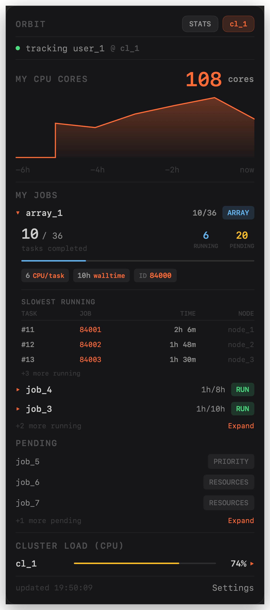
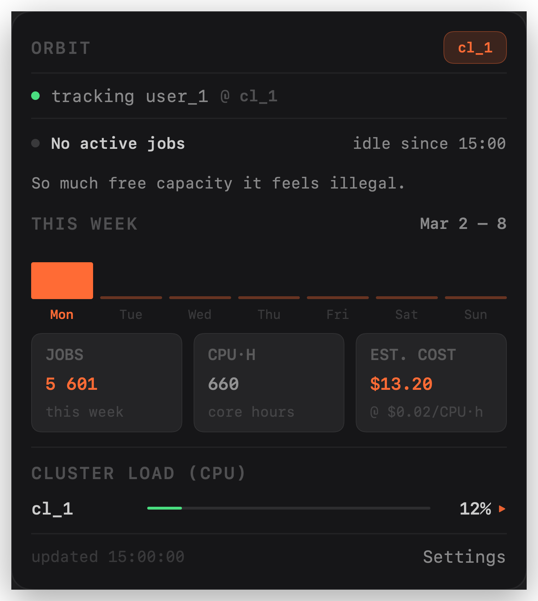

# Orbit

<p align="center">
  
</p>

Lightweight, local-first macOS menu bar monitor for SLURM user metrics.

Orbit tracks your queue and cluster activity over SSH and keeps everything local (SQLite). It includes a menu bar app (`orbit-menubar`) and a CLI (`orbit`) for scripting and diagnostics.

## Scope

Orbit is built for lightweight, local monitoring of user-level SLURM metrics:

- running / pending jobs
- array progress
- cluster CPU and node load snapshots
- desktop notifications (job completed, array finished, walltime expiring)
- optional command audit log

## Features

- First-run onboarding (cluster + SSH setup)
- Live polling and watch mode
- Stale-data fallback when polling fails
- Job details with efficiency metrics (when history is available)
- Cluster overview and node load view
- Per-node GPU inventory (capacity and, when available, used GPUs from GRES)
- Local SQLite persistence with retention + size guardrails
- Command transparency list and allowlisted execution

## Screenshots

| Jobs & arrays | Idle summary |
| --- | --- |
| <a href="docs/images/screenshots/orbit-jobs-array.png"></a> | <a href="docs/images/screenshots/orbit-summary-idle.png"></a> |

## Requirements

- macOS 13+
- Swift 5.9+ (latest Swift recommended)
- SLURM with JSON output support (21.08+)
- SSH access to your cluster login node(s)

## Build and test

```bash
swift build
swift test
```

## Run

Menu bar app:

```bash
swift run orbit-menubar
```

Smoke test:

```bash
swift run orbit-menubar --smoke-test
```

CLI:

```bash
swift run orbit
```

## Download and run

You can run Orbit without building from source:

1. Open the [GitHub Releases](https://github.com/nikitakavka/orbit/releases) page
2. Download `Orbit.app.zip` from the latest release
3. Unzip and move `Orbit.app` to `/Applications`
4. Launch `Orbit.app`

## Build a standalone `.app`

```bash
./scripts/build-macos-app.sh
```

This creates `dist/Orbit.app` with:
- proper app bundle structure (`Info.plist`, `MacOS`, `Resources`)
- generated `AppIcon.icns`
- `LSUIElement=true` (menu bar app behavior)


## Quick start

1. Launch `Orbit.app` (or run `orbit-menubar` when developing from source)
2. Complete onboarding (host, username, SSH key)
3. Run connection test

## CLI quick reference

```bash
swift run orbit profile add --name NAME --host HOST --user USER
swift run orbit profile list
swift run orbit profile enable <profile>
swift run orbit profile disable <profile>
swift run orbit profile detect-auth --host HOST --user USER

swift run orbit test <profile>
swift run orbit poll <profile>
swift run orbit watch <profile>
swift run orbit watch --all

swift run orbit status <profile> --refresh
swift run orbit status --all --active-only
swift run orbit nodes <profile>

swift run orbit audit --last 50
swift run orbit storage stats
swift run orbit storage vacuum
```

## Runtime configuration

Environment variables:

- `ORBIT_DB_PATH`
- `ORBIT_ENABLE_NOTIFICATIONS` (`0` disables notifications; default is enabled)
- `ORBIT_ENABLE_AUDIT=1`
- `ORBIT_AUDIT_RETENTION_DAYS`
- `ORBIT_HISTORY_RETENTION_DAYS`
- `ORBIT_NOTIFICATION_RETENTION_DAYS`
- `ORBIT_MAX_HISTORY_ENTRIES_PER_POLL`
- `ORBIT_MAX_DB_SIZE_MB`
- `ORBIT_MAX_COMMAND_OUTPUT_MB`

In `orbit-menubar`, you can also set audit toggle and command output cap in Settings.
Environment variables take precedence.

Example:

```bash
ORBIT_DB_PATH=/tmp/orbit.sqlite \
ORBIT_MAX_DB_SIZE_MB=150 \
swift run orbit watch --all
```

## Security and privacy

- Uses system OpenSSH (`/usr/bin/ssh`)
- Command execution is allowlisted and validated
- `BatchMode=yes` is enforced for SSH calls
- Data is stored locally (SQLite)
- Audit logging is optional and disabled by default

## Notes

- Orbit communicates with clusters via SSH (currently no Slurm REST API integration).
- The app is currently tested primarily on CPU-focused cluster setups.

## License

MIT • Nikita Kavka
